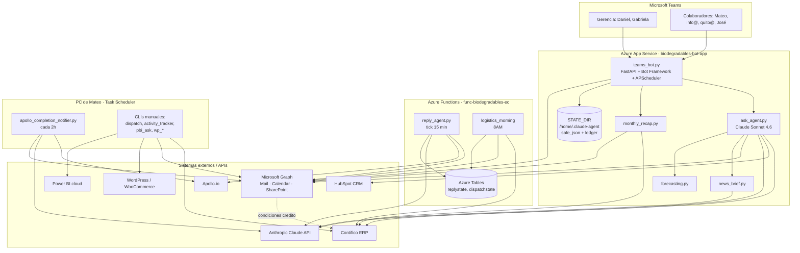

# AUTOMATIZACIONES_EMPRESA — Biodegradables Ecuador

**Documento maestro de auditoría e inventario de bots, agentes de IA y automatizaciones.**

- **Fecha de auditoría:** 2026-06-22
- **Auditor:** Claude (sesión de diagnóstico)
- **Repositorio:** `https://github.com/mateoalvarado20-maker/biodegradables-platform` (rama `master`)
- **Responsable técnico (dueño del código):** Mateo Alvarado (`malvarado@biodegradablesecuador.com`)
- **Sponsor / gerencia:** Daniel Sánchez (`dsanchez@`), Gabriela Sánchez (`gsanchez@`)
- **Alcance:** todo lo que vive en `C:\Users\Mateo` (repo) + Azure (App Service + Function App) + Task Scheduler local.

> ⚠️ **Naturaleza de este documento:** es un **diagnóstico de solo lectura**. No se movió,
> borró ni modificó ningún archivo de código. La sección [§8 Plan de migración](#8-plan-de-migración)
> propone los cambios y queda **pendiente de aprobación** antes de ejecutar nada.

---

## 0. Resumen ejecutivo

El sistema está **mucho más maduro de lo que sugiere `CLAUDE.md`**. Entre el 2026-06-12 y hoy
se completó un refactor de 6 fases (capa de state endurecida, identidad estricta, ledger de
envíos anti-duplicado, fuente única de código + CI, config central) y **el repo ya está
conectado a GitHub** con 6 PRs mergeados. La mayor deuda hoy **no es técnica sino documental**:
`CLAUDE.md` quedó desactualizado y ~10 módulos productivos no están documentados.

**Hallazgos top (detalle en [§7](#7-revisión-de-producción-riesgos-y-seguridad)):**

| # | Hallazgo | Severidad |
|---|---|---|
| H1 | `CLAUDE.md` desactualizado: ~10 módulos productivos sin documentar (`monthly_recap`, `news_brief`, `forecasting`, `conversation_history`, `credito_excel`, `graph_calendar_app`, `wp_*`) y fases R–V (José chofer, apertura/cierre de caja, TikTok) no reflejadas | Media |
| H2 | **`ADMIN_API_TOKEN` no seteado en producción** (no aparece en App Settings del bot 2026-06-12) → los 33 endpoints `/admin/*` se autentican con `MICROSOFT_APP_PASSWORD`. El secreto OAuth y el token admin son el mismo. | **Alta** |
| H3 | **Punto único de falla — Apollo Notifier:** corre SOLO en la PC de Mateo (Task Scheduler). Si la PC está apagada, no hay aviso de secuencias terminadas. Su última corrida salió con código `0xC000013A` (proceso abortado). | Media |
| H4 | Secretos en texto plano en disco local: `backups/appsettings-*.json` contienen claves de producción (Anthropic, Contifico, HubSpot, Graph secret, bot passwords). **No están versionados en git** (correcto), pero conviene cifrarlos o moverlos a un gestor de secretos. | Media |
| H5 | Código huérfano: `apollo_stats.py` nunca se importa. | Baja |
| H6 | Punto único de falla — MSAL: el token de Power BI / Graph delegado caduca a 90 días y exige re-auth manual (`python pbi_cloud.py`). | Baja |
| H7 | **No existe integración de WhatsApp ni de TikTok por API.** WhatsApp aparece solo como texto de ejemplo; TikTok es una métrica manual que el colaborador escribe en el check-in. (Aclaración de expectativa, no un defecto.) | Info |

---

## 1. Inventario de bots

Dos bots de Microsoft Teams, ambos hospedados en el **mismo App Service** (`biodegradables-bot-app`,
`teams_bot.py`). El "cerebro" conversacional de ambos es `ask_agent.py` (Claude Sonnet 4.6).

| Bot | Función | Responsable | Estado | Código | Entorno | App ID |
|---|---|---|---|---|---|---|
| **Data Bot** | Consultas de gerencia: ventas Contifico, clientes, cartera, leads/deals HubSpot, proyecciones, asignar tareas al equipo | Mateo (dev) / Daniel-Gabriela (uso) | ✅ Activo | `teams_bot.py` + `ask_agent.py` (modo `data`) | App Service `biodegradables-bot-app` → `/api/messages` | `8ef9d83a-914e-47de-9850-f630b172fc8f` |
| **Activities Bot** | Check-in diario por Adaptive Card, marcado de actividades, cobranzas, cierre de caja, recordatorios, resúmenes | Mateo | ✅ Activo | `teams_bot.py` + `ask_agent.py` (modo `activities`) | Mismo App Service → `/api/activities/messages` | `bc908e6c-a2a0-4252-9760-2d3c5f17a3f6` |
| **Reply Agent** (bot de correo, no de Teams) | Responde automáticamente a prospectos: lee inbox de Mateo, enriquece con Apollo, redacta borrador con Claude | Mateo | ✅ Activo | `reply_agent.py` | **Azure Functions** `func-biodegradables-ec` → timer `reply_agent_tick` (cada 15 min) | n/a (usa app reg `claude-agent`) |

**Endpoint legacy:** `azfunc/function_app.py` también expone `/api/messages` (vía `bot_handler.py` →
`chat_agent.py`), remanente de cuando el bot vivió en Functions. **El bot productivo es el del App
Service**; este endpoint de Functions debería confirmarse como no-cableado en el Azure Bot y
documentarse o retirarse (ver [§7](#7-revisión-de-producción-riesgos-y-seguridad)).

### Control de acceso (whitelists)

| Constante (en `teams_bot.py`) | Valor por defecto | Propósito |
|---|---|---|
| `DATA_ALLOWED_USERS` / env `BOT_ALLOWED_USERS_DATA` | dsanchez@, gsanchez@, malvarado@ | Quién puede usar el Data Bot |
| `BOT_ALLOWED_USERS_ACTIVITIES` | vacío = cualquier colaborador del tenant | Acceso al Activities Bot |
| `SUPERVISORS_ONLY` | dsanchez@ | No trackean actividades propias; supervisan |
| `WORKLOAD_SUPERVISORS` | dsanchez@, gsanchez@ | Pueden ver carga de todo el equipo (`/tareas`) |
| `CIERRE_CAJA_USERS` | info@, quito@ | Ven sub-card de cierre de caja |
| `VALIDADOR_CIERRE_POR_CIUDAD` | Guayaquil→dsanchez@, Quito→gsanchez@ | Confirman el monto reportado |
| `JOSE_SUMMARY_TO` | dsanchez@, malvarado@ | Reciben resumen de ruta del chofer GYE |

---

## 2. Inventario de agentes de IA

Tres agentes basados en Claude. Modelo único en producción: **`claude-sonnet-4-6`**.

### 2.1 `ask_agent.py` — cerebro de los bots de Teams

| Atributo | Detalle |
|---|---|
| **Modelo** | `claude-sonnet-4-6`, `max_tokens=4000`, `max_iterations=10`, system prompt con cache `ephemeral` |
| **Modos** | `data` (gerencia) y `activities` (colaboradores) |
| **Prompt del sistema** | Definido en código (`data`: ~líneas 3353-3481; `activities`: ~3250-3350). Dinámico por rol; al `data` se le inyecta el news brief diario |
| **Bases de conocimiento / contexto** | `company_context.md`, plantillas `activities_template*.json`, estado `activity_state.json`, news brief `daily_news_brief.json` |
| **APIs conectadas** | Contifico (ERP), HubSpot (CRM), Microsoft Graph (correo `graph_mail` + calendario `graph_calendar_app`), Anthropic, web_search nativo (max_uses=2) |
| **Tools modo `data`** | `get_ventas_dia/_rango/_por_ciudad`, `get_top_vendedores/_clientes`, `get_cumplimiento_mes`, `get_saldos_pendientes_clientes`, `get_hubspot_leads_ayer/_promedio_7d/_deals_ganados_ayer/_pipeline_abierto`, `forecast_sales_for_month`, `analyze_product_mix`, `web_search`, + gestión de equipo (`add_activity_for_collaborator`, `schedule_reminder_for_collaborator`, `create_calendar_meeting_for_collaborator`, `set_activity_priority_for_collaborator`, `list_team_collaborators/_workload`, `list_pending_reminders`) |
| **Tools modo `activities`** | `list_today_activities`, `mark_daily_activity`, `add_activity_to_week`, `remove_activity_from_week`, `mark_weekly_progress`, `send_daily_summary_email`, + (supervisores) las mismas tools de gestión de equipo |

### 2.2 `reply_agent.py` — respuestas a prospectos

| Atributo | Detalle |
|---|---|
| **Modelo** | `claude-sonnet-4-6` |
| **Función** | Lee inbox no leído → filtra → enriquece remitente con Apollo `/people/match` → redacta borrador en Outlook Drafts (humano en el loop, no envía) |
| **Contexto** | `company_context.md` como system prompt |
| **APIs** | Microsoft Graph (`Mail.ReadWrite`), Apollo REST, Anthropic |
| **Estado** | Azure Table `replystate` (en Functions). Local usa archivo solo en `--dry-run` |
| **Disparador** | Timer `reply_agent_tick` cada 15 min (Azure Functions) |

### 2.3 `news_brief.py` — brief de noticias diario

| Atributo | Detalle |
|---|---|
| **Modelo** | `claude-sonnet-4-6` con `web_search_20250305` nativo |
| **Función** | Resumen diario (economía Ecuador, geopolítica/supply chain, sector empaques) que se inyecta al system prompt del Data Bot y a los recaps |
| **Disparador** | Job APScheduler `daily_news_brief` (6:00 AM EC) |
| **Estado** | Escribe `~/.claude-agent/daily_news_brief.json` |

### 2.4 Apollo Completion Notifier — IA secundaria

`apollo_completion_notifier.py` usa Claude (sonnet-4-6) para **sugerir filtros de Apollo** cuando
una secuencia termina. Corre en Task Scheduler local cada 2 h (ver [§7](#7-revisión-de-producción-riesgos-y-seguridad), H3).

---

## 3. Inventario de automatizaciones (jobs programados)

### 3.1 App Service `biodegradables-bot-app` — APScheduler (zona `America/Guayaquil`)

Con *lease* de instancia única + catch-up + ledger anti-duplicado.

| Job | Horario EC | Función | Estado |
|---|---|---|---|
| `checkin_weekday` (oficina) | Lun-Vie 16:30 | Card de check-in oficina | ✅ |
| `checkin_sucursales_weekday` | Lun-Vie 17:10 | Card check-in sucursales | ✅ |
| `checkin_saturday` | Sáb 12:30 | Card check-in sábado (solo sucursales) | ✅ |
| `deliver_reminders` | cada 5 min | Entrega recordatorios vencidos | ✅ |
| `auto_assign_cobranzas` | Lun-Vie 7:30 | Auto-asigna cartera vencida por ciudad | ✅ |
| `weekly_summaries` | Vie 17:00 | Resumen semanal por colaborador | ✅ |
| `task_confirmations` | Lun-Vie 9:00 | Confirma tareas no-diarias vencidas | ✅ |
| `daily_news_brief` | Diario 6:00 | Genera brief de noticias | ✅ |
| `monthly_sales_recap_day1` | Día 1, 9:00 | Recap mensual de ventas | ✅ |
| `monthly_activities_recap_day1` | Día 1, 10:00 | Recap mensual de actividades | ✅ |
| `apertura_caja_matinal` | Lun-Vie 8:15 | Card de apertura de caja | ✅ |
| `consolidated_daily_summary` | Lun-Vie 18:30 | UN correo consolidado del equipo a gerencia | ✅ |
| `saturday_recap` | Lun 8:00 | Recap del sábado anterior | ✅ |
| `morning_sales_report` | Lun-Sáb 8:00 | **Reporte comercial diario** (reemplazó al timer azfunc) | ✅ |
| `calendar_sync` | Lun-Vie 8:45 | Sincroniza fechas límite al calendario | ⚙️ Condicional (`CALENDAR_SYNC_ENABLED=1`) |
| `logistics_morning` | Lun-Sáb 8:00 | Reporte de logística | ⚙️ Condicional (`LOGISTICS_IN_BOT=1`) |
| `cierre_recordatorios_morning` | — | Validación de cierre | ❌ Deshabilitado (Fase V, pedido de Mateo) |
| `midmonth_status` (día 15) | — | Resumen quincenal | ❌ Deshabilitado (pedido de Mateo) |

### 3.2 Function App `func-biodegradables-ec` — timers

| Timer | Horario | Función | Estado |
|---|---|---|---|
| `reply_agent_tick` | cada 15 min | Reply agent (borradores a prospectos) | ✅ |
| `logistics_morning` | 8:00 EC (13:00 UTC) | Reporte de logística | ✅ (hasta cutover al bot) |
| `morning_sales_report` | — | Reporte comercial | ❌ Eliminado del código (Fase 0) |
| `apollo_orchestrator_tick` | — | Orquestador Apollo | ❌ Eliminado del código (descartado) |

### 3.3 Task Scheduler local (PC de Mateo)

| Tarea | Trigger | Estado | Nota |
|---|---|---|---|
| `BiodegradablesEcuador-ApolloNotifier-2hrs` | cada 2 h | ⚠️ Activa pero última corrida exit `0xC000013A` | **Único job que vive solo en la PC** (SPOF, H3) |
| `BiodegradablesEcuador-DailyReport-Morning` | 8:00 | ❌ Deshabilitada | Migrado al bot |
| `BiodegradablesEcuador-LogisticsReport-Morning` | 8:00 | ❌ Deshabilitada | Migrado a azfunc |
| `BiodegradablesEcuador-ReplyAgent-15min` | 15 min | ❌ Deshabilitada | Migrado a azfunc (re-habilitar = borradores duplicados) |

---

## 4. Mapa de arquitectura



### Diagrama ASCII (resumen de dependencias)

```
                 ┌──────────── Microsoft Teams ────────────┐
                 │  Gerencia (Data Bot) · Colaboradores     │
                 └───────────────────┬──────────────────────┘
                                     │
   ┌─────────────────────────────────┼───────────────────────────────────┐
   │ App Service (teams_bot + ask_agent + scheduler) → STATE_DIR/Tables    │
   │ Functions (reply_agent 15min, logistics 8AM) → Azure Tables           │
   │ PC local (apollo_notifier 2h, CLIs: dispatch/activity/pbi/wp_*)        │
   └───┬──────────┬──────────┬──────────┬──────────┬──────────┬───────────┘
       │          │          │          │          │          │
   Contifico   HubSpot    Apollo    Anthropic   MS Graph   WordPress / PBI
    (ERP)      (CRM)    (outbound)  (Claude)  Mail/Cal/SP   (web/ads-?)
```

**Integraciones que la gerencia podría esperar y NO existen hoy:**
- **WhatsApp:** sin integración. Mencionado solo como ejemplo de tarea futura.
- **TikTok:** sin API. Es una métrica manual (seguidores/videos) que el colaborador escribe en el check-in.
- **Meta Ads / Google Ads (spend):** no conectado (requiere Marketing Hub Pro / APIs de ads).

---

## 5. Revisión de repositorios

Un solo repo monolítico: `biodegradables-platform` (raíz = `C:\Users\Mateo`, `.gitignore` por whitelist).

| Dimensión | Estado |
|---|---|
| **Estado del repo** | ✅ Limpio, en GitHub, 6 PRs mergeados, ramas de feature presentes |
| **CI/CD** | ✅ `.github/workflows/ci.yml`: ruff + `sync_azfunc --check` (anti-drift) + pytest + build del paquete |
| **Tests** | ✅ 19 archivos de test (`tests/`) — aislamiento, concurrencia, corrupción, identidad, anti-duplicado, horarios, carry-forward, José, TikTok |
| **Documentación viva** | ✅ `docs/arquitectura.md`, `docs/onboarding.md`, `docs/runbook-operativo.md`, `CONTRIBUTING.md`, `AUDITORIA_TECNICA_2026-06-12.md` |
| **Último mantenimiento** | ✅ Activo (commits hasta 2026-06-19) |
| **Dependencias** | `requirements.txt`, `requirements_bot.txt`, `requirements-dev.txt`, `pyproject.toml`. Python 3.14 local / 3.12 en CI |
| **Fuente única de código** | ✅ `azfunc/` se GENERA desde la raíz con `tools/sync_azfunc.py` (CI verifica drift) |

### Riesgos técnicos del repo

| Riesgo | Detalle |
|---|---|
| **Documentación desactualizada** (H1) | `CLAUDE.md` es la guía de entrada pero omite ~10 módulos y varias fases. Riesgo de que una sesión futura (Claude o humano) actúe con info vieja |
| **Código duplicado controlado** | `azfunc/*` duplica la raíz **a propósito** (generado). No tocar a mano. OK mientras CI corra |
| **Código huérfano** | `apollo_stats.py` (sin importadores). `archive/` bien gestionado con justificación |
| **Archivos gigantes** | `teams_bot.py` (~5800 líneas) y `ask_agent.py` (~4150 líneas) concentran demasiado. Difíciles de revisar; candidatos a dividir en módulos |
| **Caches grandes versionables** | `contifico_productos.json` (477 KB), `contifico_norm.json` (99 KB) — correctamente excluidos del git por `.gitignore` |

---

## 6. Centralización — propuesta de estructura

> **Recomendación honesta:** la estructura de carpetas propuesta
> (`/Bots /AgentesIA /Integraciones /Scripts …`) es valiosa **como taxonomía lógica**, pero
> **mover físicamente los archivos hoy es de alto riesgo y bajo beneficio**, porque:
> 1. Todos los módulos se importan **planos** (`import contifico_client`). Mover rompe imports en cadena.
> 2. `tools/sync_azfunc.py` y `tools/build_bot_package.py` asumen layout plano; el deploy a Azure se rompería.
> 3. El `.gitignore` por whitelist y el CI tendrían que reescribirse.
> 4. El refactor reciente (Fases 0-5) **ya estableció capas lógicas** documentadas en `docs/arquitectura.md`.
>
> **Propuesta:** adoptar la taxonomía como **vista lógica documentada** (este documento + `docs/`) y
> dejar el layout físico plano. Si más adelante se quiere reestructurar físicamente, hacerlo como
> paquete Python (`src/biodegradables/...`) en un PR dedicado con la batería de tests como red.

**Mapeo lógico de los módulos a la taxonomía pedida** (sin mover nada):

| Categoría propuesta | Módulos actuales |
|---|---|
| `/Bots` | `teams_bot.py`, `bot_handler.py` (azfunc), manifests, iconos |
| `/AgentesIA` | `ask_agent.py`, `reply_agent.py`, `news_brief.py`, `apollo_completion_notifier.py`, `company_context.md` |
| `/Automatizaciones` | `daily_report.py`, `daily_logistics_report.py`, `monthly_recap.py`, jobs APScheduler, timers azfunc, `.bat` |
| `/Integraciones` | `contifico_client.py`, `hubspot_client.py`, `apollo_rest.py`, `graph_mail.py`, `graph_calendar_app.py`, `outlook_client.py`, `credito_excel.py`, `wp_client.py`, `pbi_cloud.py` |
| `/Scripts` | CLIs: `dispatch.py`, `activity_tracker.py`, `pbi_ask.py`, `wp_audit/check/drafts/apply.py`, `setup_payment_reminders.py` |
| `/Documentacion` | `CLAUDE.md`, `docs/`, `CONTRIBUTING.md`, `AUDITORIA_*.md`, este documento |
| `/Backups` | `backups/` (appsettings), `bot_deploy.zip` (rollback) |

**Lo que sí conviene asegurar por proyecto/módulo** (varios ya existen): README, variables requeridas,
dependencias, instrucciones de despliegue, manual operativo, historial. Hoy esto vive centralizado en
`CLAUDE.md` + `docs/` + `CONTRIBUTING.md` en lugar de por-módulo, lo cual es razonable para un repo de este tamaño.

---

## 7. Revisión de producción (riesgos y seguridad)

### Estado por componente

| Componente | Estado |
|---|---|
| **Bots activos** | Data Bot ✅, Activities Bot ✅, Reply Agent ✅ |
| **Bots inactivos** | Endpoint bot de Functions (`/api/messages` legacy) — confirmar que el Azure Bot no apunta ahí |
| **Agentes activos** | `ask_agent` ✅, `reply_agent` ✅, `news_brief` ✅, Apollo notifier ✅ (con falla, H3) |
| **Automatizaciones huérfanas** | `apollo_stats.py` (código sin uso) |
| **APIs configuradas sin uso productivo claro** | Power BI cloud (`pbi_cloud`, `pbi_ask`, DAX) — el reporte comercial migró a Contifico; PBI quedó solo para consultas ad-hoc manuales. `MSAL_CACHE_B64` se mantiene como app setting por esto |

### Credenciales / variables de entorno (producción, backup 2026-06-12)

**App Service (bot):** `ANTHROPIC_API_KEY`, `CONTIFICO_API_TOKEN`, `HUBSPOT_TOKEN`, `GRAPH_CLIENT_ID`,
`GRAPH_TENANT_ID`, `MICROSOFT_APP_ID/PASSWORD/TENANT_ID/TYPE`, `ACTIVITIES_APP_ID/PASSWORD`,
`MSAL_CACHE_B64`, `STATE_DIR`, `KNOWN_COLLABORATORS`, `TRACKER_EMAIL_TO_*`, `MONTHLY_RECAP_TO`.
**Function App:** además `APOLLO_API_KEY`, `GRAPH_CLIENT_SECRET`, `AzureWebJobsStorage`,
`APPLICATIONINSIGHTS_CONNECTION_STRING`.

| Hallazgo de seguridad | Riesgo | Recomendación |
|---|---|---|
| **`ADMIN_API_TOKEN` ausente** (H2) | Los 33 endpoints `/admin/*` usan `MICROSOFT_APP_PASSWORD` como token. Quien conozca el secreto del bot controla todo el state | **Setear `ADMIN_API_TOKEN` distinto** en el App Service (separa admin del secreto OAuth) — ya estaba como pendiente #3 |
| **Secretos en disco local** (H4) | `backups/appsettings-*.json` con todas las claves en texto plano | No versionados (✅). Cifrar el folder o migrar secretos a Azure Key Vault / referencias de App Settings |
| **`MSAL_CACHE_B64` como app setting** | Material de token en variable de entorno | Aceptable a corto plazo; Key Vault a futuro |
| **`GRAPH_CLIENT_SECRET` con caducidad** | Si expira, se cae el envío de correo app-only (logística, reportes) | Documentar fecha de expiración y recordatorio de rotación |

### Puntos únicos de falla (SPOF)

1. **Apollo Notifier en la PC de Mateo (H3)** — si la PC está apagada/suspendida no hay aviso; además su última corrida abortó (`0xC000013A`). → Migrar a un timer de Azure Functions (como ya se hizo con los demás).
2. **Una sola instancia del App Service** — APScheduler con lease single-instance + catch-up mitiga, pero un outage del App Service tumba todos los jobs hasta el reinicio.
3. **MSAL token (H6)** — caduca a 90 días; re-auth manual.
4. **Doble residencia local + Azure** — re-habilitar una schtask local migrada (reply agent, logística) duplica envíos. Mitigado por `archive/` y notas, pero es una trampa latente.

---

## 8. Plan de migración

> **Principio rector (tu instrucción):** sin cambios destructivos automáticos. Cada paso abajo es
> una **propuesta**; nada se ejecuta hasta tu aprobación. Casi todo es de bajo riesgo porque el repo
> ya tiene tests + CI como red de seguridad.

### Fase 0 — Respaldo y validación previa (antes de tocar nada)
- [ ] `git status` limpio + tag de punto seguro: `git tag pre-auditoria-2026-06-22`.
- [ ] Backup fresco de App Settings (bot + func) y del `STATE_DIR` (`/home/.claude-agent`).
- [ ] Correr la suite: `python -m pytest tests/ -q` (debe pasar) y `python tools/sync_azfunc.py --check`.

### Fase 1 — Documental (riesgo nulo, alto valor) — **recomendado primero**
- [ ] Adoptar este `AUTOMATIZACIONES_EMPRESA.md` como documento maestro.
- [ ] Actualizar `CLAUDE.md`: agregar los módulos faltantes (H1), marcar GitHub como conectado, reflejar fases R–V, José, caja.
- [ ] Documentar fechas de rotación de secretos (Graph secret, bot passwords, tokens).

### Fase 2 — Endurecer seguridad (riesgo bajo)
- [ ] **H2:** setear `ADMIN_API_TOKEN` propio en el App Service y validar que `/admin/*` siga respondiendo.
- [ ] **H4:** cifrar o reubicar `backups/appsettings-*.json`; evaluar Azure Key Vault.
- [ ] Confirmar/retirar el endpoint bot legacy de Functions.

### Fase 3 — Eliminar SPOF y código huérfano (riesgo bajo-medio)
- [ ] **H3:** migrar `apollo_completion_notifier.py` a un timer de Azure Functions; deshabilitar la schtask local. (Diagnosticar antes el exit `0xC000013A`.)
- [ ] **H5:** decidir sobre `apollo_stats.py` → integrarlo al reporte o moverlo a `archive/` con justificación.

### Fase 4 — Centralización lógica (opcional, riesgo medio si es física)
- [ ] Si se aprueba: mantener layout plano y formalizar la taxonomía de [§6](#6-centralización--propuesta-de-estructura) como vista documentada.
- [ ] Reestructuración física a paquete `src/` **solo** en PR dedicado, con tests como red, fuera de ventana operativa.

### Cronograma sugerido (sin interrumpir producción)
| Semana | Fase | Ventana |
|---|---|---|
| 1 | Fase 0 + 1 | Cualquier momento (solo docs) |
| 1-2 | Fase 2 | Fuera de horario operativo (8 AM – 6:30 PM EC son horas de jobs) |
| 2-3 | Fase 3 | Fin de semana / noche |
| Backlog | Fase 4 | Cuando haya capacidad de dev dedicada |

---

## 9. Recomendaciones priorizadas

1. **(Alta)** Setear `ADMIN_API_TOKEN` y rotar/separar del secreto del bot (H2).
2. **(Media)** Actualizar `CLAUDE.md` para que refleje la realidad (H1) — evita errores de operación futuros.
3. **(Media)** Migrar Apollo Notifier a Azure y diagnosticar su falla actual (H3).
4. **(Media)** Cifrar/mover los backups con secretos en disco (H4).
5. **(Baja)** Resolver `apollo_stats.py` (H5) y documentar rotación de secretos/MSAL (H6).
6. **(Info)** Confirmar con gerencia que WhatsApp/TikTok/Ads **no** están integrados, para alinear expectativas (H7).

---

*Generado por auditoría de solo lectura. Ningún archivo de código fue modificado.*
