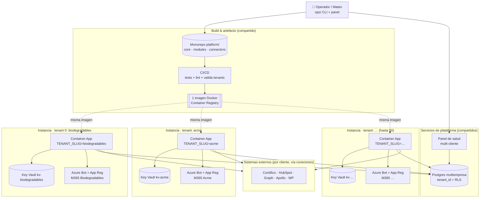
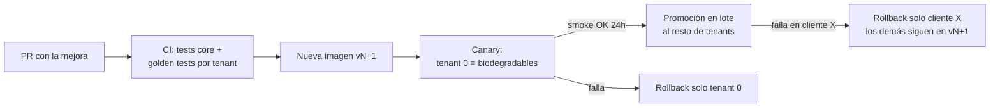

# Propuesta — Arquitectura Multiempresa (plataforma de automatización)

**Autor:** Claude (diagnóstico + propuesta para revisión)
**Fecha:** 2026-06-22
**Estado:** PROPUESTA. No se ha hecho ningún cambio en el código. Este documento
es para revisión y discusión antes de tocar nada.
**Complementa:** `AUDITORIA_TECNICA_2026-06-12.md`, `docs/arquitectura.md`,
`AUTOMATIZACIONES_EMPRESA.md`.

> **Objetivo del encargo:** poder desplegar la *misma* plataforma en decenas de
> empresas (meta de diseño: **50 clientes**) con el mínimo esfuerzo, sin una
> versión por cliente, sin duplicar código, sin múltiples repos con lógica
> similar y sin prompts/config hardcodeados. Una empresa nueva debe entrar por
> **configuración + documentación + conexión de integraciones**, jamás por
> modificar la lógica principal.

> **Modelo de negocio (importante para el diseño):** tú NO vendes el código.
> Vendes implementación, configuración y soporte. → La plataforma debe estar
> optimizada para que **tú** (un operador) instales y mantengas N clientes, no
> para que cada cliente edite código. Esto empuja hacia *configuración
> declarativa + un solo árbol de código + tooling de onboarding*.

---

## 0. TL;DR (resumen ejecutivo)

**Diagnóstico:** El sistema actual es técnicamente sólido para UN cliente
(post-refactor de junio 2026: state endurecido, ledger anti-duplicado,
identidad estricta, tests). Pero es **mono-tenant en cada capa**: el dominio
de la empresa, los destinatarios, los feriados, los prompts y hasta los IDs de
los bots están horneados en el código o en env-vars globales del proceso. Hay
**~62 referencias literales a `biodegradablesecuador.com`** repartidas en
2 archivos, ~142 a Contifico, ~87 a Apollo, ~65 a HubSpot. Dos monolitos
(`teams_bot.py` 235 KB, `ask_agent.py` 182 KB) concentran orquestación +
prompts + tools + cards. La config ya empezó a centralizarse (`core_config.py`),
pero asume **un proceso = una empresa**.

**Propuesta (en una frase):** convertir el repo en un **monorepo de núcleo +
módulos + conectores**, donde cada empresa es un **paquete de configuración**
(`tenants/<slug>/`) con sus secretos en un vault, sus prompts como overlays, y
sus módulos activados por flags — todo corriendo sobre **una sola imagen de
código** desplegada como **una instancia aislada por cliente** (contenedor +
config inyectada), con estado en **Postgres multiempresa** (`tenant_id` en cada
fila) en vez de archivos JSON.

**Decisión clave que recomiendo:** *aislamiento por instancia, código
compartido*. Un solo árbol de código y una sola imagen Docker; cada cliente
recibe su propio contenedor/App Service + su propia DB lógica + su propio
registro de Azure Bot. Esto da el equilibrio correcto entre "no duplicar
código" (hay UN código) y las restricciones reales de Microsoft Teams / Graph /
multi-tenant M365 (cada empresa es su propio tenant de Azure AD y exige su
propio bot registration y su propio consentimiento). Ver §4 para por qué no
recomiendo un único proceso multi-tenant compartido.

---

## 1. Mapa de la arquitectura ACTUAL

### 1.1 Runtimes (dónde corre cada cosa hoy)

```
┌──────────────────────────────────────────────────────────────────────┐
│ App Service  biodegradables-bot-app   (rg-biodegradables-prod)        │
│   teams_bot.py  (FastAPI + Bot Framework + APScheduler)  235 KB       │
│     • Data Bot       /api/messages            (gerencia)              │
│     • Activities Bot /api/activities/messages (colaboradores)         │
│     • Scheduler (lease de instancia única): check-ins, reminders,     │
│       cobranzas, weekly/monthly/consolidado, morning_sales 8:00       │
│   Estado: /home/.claude-agent  (archivos JSON via safe_json)          │
├──────────────────────────────────────────────────────────────────────┤
│ Function App  func-biodegradables-ec   (Consumption)                  │
│   azfunc/  ← GENERADO desde la raíz (tools/sync_azfunc.py)            │
│     • logistics_morning (8:00)   • reply_agent_tick (cada 15 min)     │
│   Estado: Azure Tables (dispatchstate, replystate)                    │
├──────────────────────────────────────────────────────────────────────┤
│ PC de Mateo (Task Scheduler local)                                    │
│   • ApolloNotifier-2hrs (única tarea activa)                          │
│   • CLIs manuales: dispatch.py, activity_tracker.py, pbi_ask.py       │
│   Estado: archivos JSON locales + MSAL token cache                    │
└──────────────────────────────────────────────────────────────────────┘
```

### 1.2 Capas de código (ya existen — esto es lo bueno que conservamos)

| Capa | Módulos | Rol |
|---|---|---|
| **Infraestructura** | `safe_json`, `send_ledger`, `core_config` | State atómico, anti-duplicado, config de negocio |
| **Estado de dominio** | `activity_state`, `reminders`, `dispatch_state`, `reply_state`, `conversation_history` | Un módulo = un dato = un dueño |
| **Clientes de API** | `contifico_client`, `hubspot_client`, `apollo_rest`, `graph_mail`, `outlook_client`, `calendar_client`, `pbi_cloud`, `wp_client` | Llamadas externas, sin lógica de negocio |
| **Reportes** | `daily_report`, `daily_logistics_report`, `monthly_recap`, `news_brief`, `weekly`(en bot) | Generan y envían correos |
| **Agentes IA** | `ask_agent` (tools + prompts), `reply_agent`, `apollo_completion_notifier` | Claude API con tools |
| **Apps / orquestación** | `teams_bot`, `azfunc/function_app` | Solo orquestan; llaman a las capas de abajo |

### 1.3 Inventario funcional (lo que el sistema HACE)

Agrupado por **capacidad de negocio** — esta es la lista que se vuelve el
catálogo de módulos en §3.

| # | Capacidad | Módulos hoy | Depende de |
|---|---|---|---|
| F1 | **Reporte comercial diario** (ventas vs meta, semáforos) | `daily_report` | ERP (Contifico), Mail (Graph) |
| F2 | **Reporte de logística diario** (envíos por ciudad/provincia) | `daily_logistics_report`, `dispatch_state`, `dispatch` | ERP, Mail |
| F3 | **Recap mensual / forecasting** | `monthly_recap`, `forecasting` | ERP, Mail |
| F4 | **Brief de noticias** | `news_brief` | Web/API noticias, Mail |
| F5 | **Bot de datos en Teams** (NL → KPIs) | `teams_bot` (Data), `ask_agent` modo `data` | ERP, CRM, LLM |
| F6 | **Bot de actividades en Teams** (check-in, tracker, cierre caja) | `teams_bot` (Activities), `activity_state`, `reminders` | LLM, Mail |
| F7 | **Tracking de actividades de equipo** + resúmenes consolidados | `activity_state`, `activities_template*` | Mail |
| F8 | **Cobranzas auto-asignadas** | `teams_bot` job, `contifico_client`, `credito_excel` | ERP |
| F9 | **Agente de respuestas a prospectos** (drafts) | `reply_agent`, `apollo_rest`, `outlook_client` | Prospección (Apollo), Mail, LLM |
| F10 | **Notificador de secuencias Apollo** + sugerencia IA | `apollo_completion_notifier` | Prospección, LLM, Mail |
| F11 | **Recordatorios de pagos** (calendario) | `setup_payment_reminders`, `calendar_client`, `graph_calendar_app` | Calendar (Graph) |
| F12 | **Integración WordPress** (auditoría/SEO/drafts) | `wp_client`, `wp_audit`, `wp_apply`, `wp_drafts`, `wp_check` | WordPress/WooCommerce |
| F13 | **Consultas ad-hoc Power BI** (uso interno) | `pbi_ask`, `pbi_cloud`, `pbi_discover` | Power BI |

### 1.4 Funcionalidad REPETIDA (candidata a consolidar)

Esto es el corazón del diagnóstico. Patrones que aparecen N veces:

1. **Envío de correo HTML** — `graph_mail.send()`, `pbi_cloud.send_email()`,
   y plantillas HTML inline (estilos en `<td>` por el bug de Outlook) repetidas
   en `daily_report`, `daily_logistics_report`, `monthly_recap`, `weekly`,
   cierre de caja, resúmenes consolidados. **Cada reporte reinventa el HTML.**
2. **Construcción de system prompts** — `_system_prompt_data()`,
   `_system_prompt_activities()`, prompt de `reply_agent`, prompt del notifier
   Apollo. Todos concatenan "Eres … de Biodegradables Ecuador" + contexto.
3. **Definición de tools de Claude** — un único `TOOLS = [...]` gigante en
   `ask_agent.py` mezcla tools de ERP, CRM, tracker y delegación; el modo
   filtra cuáles aplican. No hay registro modular.
4. **Resolución de identidad / allowlist** — `AAD_ID_TO_EMAIL`,
   `KNOWN_COLLABORATORS`, `BOT_ALLOWED_USERS_*`, `SUPERVISORS_ONLY`,
   `CIERRE_CAJA_USERS` — varias estructuras paralelas de "quién es quién".
5. **Cálculo de días hábiles / feriados / TZ Ecuador** — centralizado en
   `core_config.holidays_for` (bien), pero el locale (país, TZ, idioma) es fijo.
6. **Lectura de config por env-var** — el patrón `_env_list` / `os.environ.get`
   está disperso; cada módulo lee sus propias env-vars con defaults de
   Biodegradables horneados.
7. **Persistencia de state JSON** — `activity_state`, `reminders`,
   `dispatch_state`, `reply_state`, `conversation_history` repiten el patrón
   load/save/lock sobre `safe_json` con rutas a `~/.claude-agent`.
8. **Duplicación raíz ↔ azfunc** — 14 módulos existen 2 veces; `sync_azfunc.py`
   los mantiene iguales por copia. Funciona, pero es duplicación física.

### 1.5 Qué está bien (y NO se toca)

- `safe_json` (atómico + backup + cuarentena + locks) — se reusa tal cual.
- `send_ledger` (claim/confirm anti-duplicado) — patrón clave para N clientes.
- `_reliable_job` (retry + alerta + catch-up) — idem.
- Identidad estricta (rechazar no-identificados) — disciplina correcta.
- La separación en capas ya existe conceptualmente; falta hacerla física.
- Suite de 50+ tests — base para no romper nada en la migración.

---

## 2. Mapa de la arquitectura PROPUESTA

### 2.1 Principio rector

> **Un solo árbol de código. La empresa es un dato, no una rama.**
> El código nunca menciona "Biodegradables", "Contifico", "Ecuador" ni un
> correo literal. Todo eso vive en `tenants/<slug>/` (config + prompts +
> referencias a secretos). Activar un cliente = crear ese paquete + conectar
> integraciones + desplegar una instancia.

### 2.2 Vista de capas (nueva)

```
┌─────────────────────────────────────────────────────────────────────┐
│  RUNTIME (por cliente: 1 contenedor / App Service + 1 Azure Bot)     │
│   app/  → FastAPI + Bot Framework + Scheduler                        │
│   Arranca: lee TENANT_SLUG → carga TenantContext → registra módulos  │
├─────────────────────────────────────────────────────────────────────┤
│  CORE (engine, idéntico para todos)                                  │
│   • TenantContext   (config + secretos + locale resueltos)           │
│   • Module registry (qué F1..F13 están activos)                      │
│   • Prompt engine   (base + overlay del tenant)                      │
│   • Tool registry   (cada módulo aporta sus tools)                   │
│   • Scheduler engine (jobs declarados por módulo, con send_ledger)   │
│   • Mailer (HTML templating unificado) · Identity · safe_json/DB     │
├─────────────────────────────────────────────────────────────────────┤
│  MODULES (capacidades de negocio, opt-in por cliente)                │
│   commercial_report · logistics_report · monthly_recap · news_brief  │
│   data_bot · activities_bot · team_tracker · collections             │
│   prospecting_reply · prospecting_notifier · payment_reminders · cms  │
├─────────────────────────────────────────────────────────────────────┤
│  CONNECTORS (adaptadores a sistemas externos, por interfaz)          │
│   ERP:  ErpConnector  → ContificoErp | (futuros: SAP, Odoo, Excel)   │
│   CRM:  CrmConnector  → HubspotCrm   | (Pipedrive, Zoho…)            │
│   MAIL: MailConnector → GraphMail    | (SMTP, SendGrid)              │
│   CAL:  CalendarConnector → GraphCalendar                            │
│   PROSPECTING → Apollo  · CMS → WordPress · BI → PowerBI · LLM       │
├─────────────────────────────────────────────────────────────────────┤
│  PLATFORM SERVICES (compartidos entre clientes)                      │
│   Postgres multiempresa (tenant_id) · Key Vault (secretos/tenant)    │
│   Container Registry (1 imagen) · Panel de operador (altas/health)   │
└─────────────────────────────────────────────────────────────────────┘
```

### 2.3 Flujo de arranque de una instancia

```
ENV: TENANT_SLUG=acme   →
  1. TenantContext.load("acme")
       ├─ tenants/acme/config.yaml        (negocio: recipients, locale, flags)
       ├─ tenants/acme/modules.yaml        (qué módulos ON/OFF + params)
       ├─ tenants/acme/prompts/*.md        (overlays de prompt)
       └─ Key Vault "kv-acme"              (secretos: tokens ERP/CRM/Graph/LLM)
  2. ConnectorFactory.build(ctx)           (instancia solo los conectores que
                                            los módulos activos necesitan)
  3. ModuleRegistry.load(ctx)              (registra F1..F13 activos)
       ├─ cada módulo aporta: tools, jobs de scheduler, rutas, cards
  4. App levanta FastAPI + Bot + Scheduler con SOLO lo de este tenant
```

Mismo binario para los 50 clientes. La diferencia entre `acme` y
`biodegradables` es **100% datos**.

---

## 3. Componentes reutilizables (qué se modulariza y cómo)

### 3.1 Conectores (interfaces estables, implementaciones intercambiables)

La clave para "cliente B no usa Contifico" es programar contra **interfaces**,
no contra Contifico. Ejemplo de la interfaz ERP:

```python
# core/connectors/erp/base.py
class ErpConnector(Protocol):
    def ventas_dia(self, d: date) -> Money: ...
    def ventas_rango(self, desde: date, hasta: date) -> list[Venta]: ...
    def facturas(self, desde: date, hasta: date) -> list[Factura]: ...
    def cartera_vencida(self, ciudad: str | None) -> list[Deuda]: ...
    # ... contrato mínimo que los módulos consumen
```

| Interfaz | Implementación actual | Futuras (sin tocar módulos) |
|---|---|---|
| `ErpConnector` | `ContificoErp` (envuelve `contifico_client`) | SAP, Odoo, "Excel/CSV", API genérica |
| `CrmConnector` | `HubspotCrm` | Pipedrive, Zoho, Salesforce |
| `MailConnector` | `GraphMail` (app-only) | SMTP, SendGrid |
| `CalendarConnector` | `GraphCalendar` | Google Calendar |
| `ProspectingConnector` | `ApolloProspecting` | Lemlist, Instantly |
| `CmsConnector` | `WordPressCms` | Shopify, ninguno |
| `LlmConnector` | `Anthropic` (claude-opus/sonnet) | — |

**Regla:** un módulo NUNCA importa `contifico_client` directamente. Pide
`ctx.erp`. Si el cliente no tiene ERP configurado y un módulo lo requiere, el
registro de módulos **falla en el arranque con un error claro** (no silenciosa).

### 3.2 Módulos (las capacidades F1..F13 empaquetadas)

Cada módulo es un paquete autocontenido con un contrato fijo:

```python
# core/modules/base.py
class Module(Protocol):
    key: str                      # "commercial_report"
    requires: list[str]           # ["erp", "mail"]  ← conectores necesarios
    def tools(self, ctx) -> list[Tool]: ...        # tools para el LLM (si aplica)
    def jobs(self, ctx) -> list[ScheduledJob]: ... # jobs de scheduler
    def routes(self, ctx) -> list[Route]: ...      # endpoints HTTP (si aplica)
```

El **module registry** lee `tenants/<slug>/modules.yaml`, instancia solo los
módulos `enabled: true`, valida que sus `requires` estén configurados, y
agrega sus tools/jobs/routes al runtime. Activar F2 para un cliente nuevo =
una línea YAML, cero código.

### 3.3 Mailer unificado (mata la repetición #1)

Un solo `core/mail/renderer.py` con:
- helpers `kpi_card()`, `table()`, `banner()` con estilos inline (preserva el
  fix de Outlook documentado en CLAUDE.md issue #3),
- branding por tenant (logo, color corporativo, firma) desde `config.yaml`,
- los reportes pasan **datos**, no HTML.

### 3.4 Prompt engine (mata la repetición #2 y #8) — ver §7.

### 3.5 Tool registry (mata la repetición #3)

`ask_agent.TOOLS` deja de ser una lista monolítica. Cada módulo declara sus
tools; el registry las agrega según los módulos activos del tenant y el "modo"
(data/activities). El system prompt se arma con solo las tools presentes.

---

## 4. Modelo de tenancy y despliegue (la decisión grande)

### 4.1 Opciones evaluadas

| Modelo | Descripción | Veredicto |
|---|---|---|
| **A. Un proceso multi-tenant** | Un solo App Service sirve a los 50; resuelve tenant por request | ❌ No recomendado (ver abajo) |
| **B. Instancia aislada / cliente, código compartido** | 1 imagen Docker; N contenedores, cada uno con `TENANT_SLUG` | ✅ **Recomendado** |
| **C. Repo/deploy por cliente (status quo escalado)** | Copiar el repo por cliente | ❌ Es justo lo que se quiere evitar |

### 4.2 Por qué B y no A

El sueño "un proceso para todos" choca con restricciones **reales** de este
stack, no teóricas:

1. **Cada empresa es su propio tenant de Microsoft 365 / Azure AD.** El bot de
   Teams necesita un **App Registration por empresa** (o uno multi-tenant con
   admin-consent individual de cada una) y el envío de correo app-only usa
   credenciales del tenant del cliente. No hay forma de evitar N identidades
   de Azure; eso ya rompe el "un solo proceso, una sola credencial".
2. **Aislamiento de datos = argumento de venta + menor riesgo.** Un bug que
   cruce `tenant_id` filtra datos comerciales entre empresas competidoras. Con
   instancias separadas, ese fallo es **imposible por construcción**, no por
   disciplina de código (la misma filosofía que el refactor ya adoptó con la
   identidad estricta).
3. **Blast radius.** Un cliente con un dataset gigante o un crash no afecta a
   los otros 49. Deploys y rollbacks pueden ser por cliente.
4. **El scheduler ya asume "una instancia, un negocio"** (lease de instancia
   única, jobs globales). Hacerlo multi-tenant dentro de un proceso es
   reescribir la pieza más delicada; correr N schedulers aislados es gratis.

**Costo de B:** N contenedores. Con imágenes pequeñas en Azure Container Apps
(escala a cero / consumo) o App Service plan compartido, 50 instancias son
baratas y se administran por Infra-as-Code. El **código sigue siendo uno solo**
— que es la meta real. "No duplicar código" ≠ "un solo proceso".

> Esto actualiza el ADR #1 del refactor ("JSON en vez de DB, revisar a >25
> usuarios o 2º escritor"): con 50 clientes **se cruza ese umbral** → §5 migra
> a Postgres. Los conteos por cliente siguen siendo chicos, pero el operador
> necesita una vista central y backups uniformes.

---

## 5. Base de datos multiempresa

### 5.1 Por qué migrar de JSON a Postgres ahora

Con 1 empresa y ~7 usuarios, `safe_json` era la decisión correcta (ADR #1).
Con 50 empresas:
- backups, métricas y soporte necesitan **una sola fuente consultable**;
- el operador quiere un panel "¿qué clientes fallaron el envío de hoy?";
- archivos JSON en discos de 50 contenedores efímeros (Container Apps) no
  persisten bien.

**Recomendación:** **un Postgres** (Azure Database for PostgreSQL Flexible
Server) con **aislamiento por `tenant_id` + Row-Level Security**. Una sola DB
operada, aislamiento lógico fuerte. (Alternativa: schema-por-tenant si un
cliente exige aislamiento físico; el modelo lo soporta cambiando el connection
string en su config.)

### 5.2 Esquema (núcleo)

```sql
-- Registro de empresas
CREATE TABLE tenant (
  id            uuid PRIMARY KEY,
  slug          text UNIQUE NOT NULL,        -- "biodegradables", "acme"
  display_name  text NOT NULL,
  locale        text NOT NULL DEFAULT 'es-EC',
  timezone      text NOT NULL DEFAULT 'America/Guayaquil',
  status        text NOT NULL DEFAULT 'active', -- active|onboarding|suspended
  created_at    timestamptz NOT NULL DEFAULT now()
);

-- Identidad de personas (reemplaza KNOWN_COLLABORATORS, AAD_ID_TO_EMAIL, allowlists)
CREATE TABLE tenant_user (
  id            uuid PRIMARY KEY,
  tenant_id     uuid NOT NULL REFERENCES tenant(id),
  email         text NOT NULL,
  aad_object_id text,                        -- identidad fuerte (nunca display name)
  full_name     text,
  roles         text[] NOT NULL DEFAULT '{}',-- supervisor, sucursal, gerencia...
  branch        text,                        -- UIO/GYE/...
  UNIQUE (tenant_id, email)
);

-- Estado de dominio: TODO lleva tenant_id (RLS lo fuerza)
CREATE TABLE activity_state  (tenant_id uuid, user_email text, iso_week text, data jsonb, ...);
CREATE TABLE reminder        (tenant_id uuid, id uuid, payload jsonb, due_at timestamptz, recurrence text, ...);
CREATE TABLE dispatch_state  (tenant_id uuid, factura text, status text, reason text, marked_by text, ts timestamptz);
CREATE TABLE reply_state     (tenant_id uuid, message_id text, processed_at timestamptz);
CREATE TABLE conversation_ref(tenant_id uuid, user_email text, ref jsonb);
CREATE TABLE send_ledger     (tenant_id uuid, job_key text, slot date, status text, ...,
                              PRIMARY KEY (tenant_id, job_key, slot));  -- anti-duplicado por tenant

-- Row-Level Security: ninguna query ve otro tenant aunque el código tenga un bug
ALTER TABLE activity_state ENABLE ROW LEVEL SECURITY;
CREATE POLICY t ON activity_state USING (tenant_id = current_setting('app.tenant_id')::uuid);
-- (idéntico para las demás tablas con tenant_id)
```

### 5.3 Cómo migra el state actual

El patrón actual (módulos de dominio sobre `safe_json`) se respeta: se cambia
el **backend** de cada módulo de estado (load/save) de "archivo JSON" a
"tabla con `tenant_id`", manteniendo la misma API pública. `dispatch_state` y
`reply_state` ya tienen backend dual (archivo / Azure Table) — ese mismo patrón
de abstracción es el que se generaliza a un `StateStore`.

> **Lo que NO cambia:** `send_ledger` (ahora con PK por tenant), las garantías
> anti-duplicado y la idempotencia. Se preservan, ahora por empresa.

---

## 6. Sistema de configuración por cliente

### 6.1 Estructura de un paquete de tenant

```
tenants/
  biodegradables/
    config.yaml          # identidad de negocio, recipients, locale, branding, thresholds
    modules.yaml         # qué módulos ON/OFF + params por módulo
    integrations.yaml    # qué conector usa cada interfaz + REFERENCIAS a secretos
    prompts/
      data_bot.md        # overlay (solo lo propio del cliente)
      activities_bot.md
      reply_agent.md
      company_context.md  # el catálogo/tono (hoy company_context.md global)
    holidays.yaml        # feriados del país del cliente (o referencia a un set compartido)
    templates/           # overrides opcionales de actividades (activities_template*)
  acme/
    ... (mismo shape)
```

Los **secretos NO viven en el repo**: `integrations.yaml` referencia nombres
de Key Vault. Ejemplo:

```yaml
# tenants/biodegradables/integrations.yaml
erp:
  provider: contifico
  secret_ref: kv://kv-biodegradables/CONTIFICO_API_TOKEN
crm:
  provider: hubspot
  secret_ref: kv://kv-biodegradables/HUBSPOT_TOKEN
mail:
  provider: graph
  app_id_ref:     kv://kv-biodegradables/GRAPH_APP_ID
  app_secret_ref: kv://kv-biodegradables/GRAPH_APP_SECRET
  tenant_id:      aec07a63-...        # no secreto, ID público del tenant AAD
prospecting:
  provider: apollo
  secret_ref: kv://kv-biodegradables/APOLLO_MASTER_KEY
llm:
  provider: anthropic
  secret_ref: kv://shared/ANTHROPIC_API_KEY   # puede ser tuyo, compartido
```

```yaml
# tenants/biodegradables/config.yaml
display_name: "Biodegradables Ecuador"
locale: es-EC
timezone: America/Guayaquil
recipients:
  commercial_report: [dsanchez@…, gsanchez@…]
  commercial_report_cc: [malvarado@…]
  logistics_report: [gsanchez@…]
branding:
  brand_color: "#2E7D32"
  logo_url: "https://…/logo.png"
commercial:
  meta_factor: 1.20
  py_override: { "2026-05": 38000.0 }
  thresholds: { cumpl_verde: 1.00, cumpl_amarillo: 0.85, mora_verde: 0.05 }
checkin:
  oficina:    { users: [malvarado@…, gsanchez@…], weekday_time: "16:30" }
  sucursales: { users: [info@…, quito@…], weekday_time: "17:10", saturday_time: "12:30" }
```

### 6.2 Validación de config (clave para "onboarding sin tocar código")

Un **schema JSON/Pydantic** valida cada paquete de tenant al arrancar y en CI.
Si falta un recipient que un módulo activo necesita, o un `secret_ref` no
resuelve, o se referencia un conector inexistente → **falla con mensaje claro**
antes de levantar. Esto convierte el onboarding en "llená el YAML hasta que el
validador pase", documentable para alguien no-programador.

`core_config.py` actual se vuelve el **default + el loader del schema**: deja de
tener literales de Biodegradables; esos pasan a `tenants/biodegradables/`.

---

## 7. Sistema de prompts por cliente

### 7.1 Estructura en capas (base compartida + overlay del tenant)

```
core/prompts/                       # versionado con el código, igual para todos
  data_bot.base.md                  # "Eres un asistente de datos comerciales.
                                    #  Tienes estas tools: {tools}. Reglas: …"
  activities_bot.base.md
  reply_agent.base.md
tenants/<slug>/prompts/
  company_context.md                # catálogo, diferenciadores, tono (lo de hoy)
  data_bot.md                       # SOLO overrides/extras del cliente
```

El **prompt engine** compone:

```
system_prompt = render(
    base    = core/prompts/<role>.base.md,
    context = tenants/<slug>/prompts/company_context.md,
    overlay = tenants/<slug>/prompts/<role>.md,   # opcional
    vars    = { display_name, locale, tools_disponibles, user_role, ... }
)
```

Reglas:
- El **base** nunca menciona una empresa; usa variables `{{display_name}}`.
- El **overlay** del tenant solo agrega/ajusta (tono, reglas de negocio, "no
  mencionar a X en el primer contacto" — como el feedback ya guardado).
- Los prompts son **archivos**, no strings en `.py` → editables sin deploy de
  código (se versiona el paquete del tenant).
- **Versionado:** cada prompt lleva un `version:` en frontmatter; el render lo
  loguea junto al envío para poder auditar "qué prompt produjo esta respuesta".

### 7.2 Qué pasa con `company_context.md`

Hoy es un único archivo global cargado por `reply_agent`. Pasa a
`tenants/<slug>/prompts/company_context.md`. Cero cambio conceptual: el
`reply_agent` deja de abrir una ruta fija y pide `ctx.prompts.company_context`.

---

## 8. Sistema de gestión de agentes y módulos (activar/desactivar)

### 8.1 `modules.yaml` por tenant

```yaml
# tenants/acme/modules.yaml  — ACME es una distribuidora SIN prospección ni CMS
commercial_report:   { enabled: true,  schedule: "08:00" }
logistics_report:    { enabled: true,  schedule: "08:00" }
monthly_recap:       { enabled: true }
news_brief:          { enabled: false }
data_bot:            { enabled: true }
activities_bot:      { enabled: true }
team_tracker:        { enabled: true }
collections:         { enabled: true }
prospecting_reply:   { enabled: false }   # ACME no hace outbound
prospecting_notifier:{ enabled: false }
payment_reminders:   { enabled: true }
cms_wordpress:       { enabled: false }   # ACME no tiene web con nosotros
```

### 8.2 Cómo lo usa el runtime

1. `ModuleRegistry` lee el YAML, instancia los módulos `enabled`.
2. Por cada módulo valida `requires` contra `integrations.yaml`
   (ej. `collections` requiere `erp`; si ACME no tiene ERP → error de arranque).
3. Agrega sus **tools** al tool-registry del LLM, sus **jobs** al scheduler
   (cada job con su clave en `send_ledger`), sus **rutas** al FastAPI.
4. El system prompt se arma con SOLO las tools presentes → el bot de ACME ni
   menciona capacidades que no tiene.

Resultado: el catálogo de capacidades es un **menú**. Un cliente enciende lo
que contrata. Encender F4 para alguien que antes no lo tenía = una línea +
redeploy de su instancia (segundos), nunca un cambio de lógica.

---

## 9. Estructura de directorios y repos

**Recomendación: monorepo único** (mata "múltiples repos con lógica similar").

```
platform/                          # UN repo
├─ core/                           # engine — sin nada de ningún cliente
│  ├─ context.py                   # TenantContext (carga config+secretos+locale)
│  ├─ config/                      # schema (Pydantic) + loader + defaults
│  ├─ modules/                     # base.py (contrato) + registry
│  ├─ connectors/                  # base.py por interfaz + factory
│  │   ├─ erp/      (base, contifico)
│  │   ├─ crm/      (base, hubspot)
│  │   ├─ mail/     (base, graph, smtp)
│  │   ├─ calendar/ · prospecting/ · cms/ · bi/ · llm/
│  ├─ prompts/                     # *.base.md + render engine
│  ├─ mail/                        # renderer HTML unificado
│  ├─ scheduling/                  # scheduler engine + send_ledger + _reliable_job
│  ├─ state/                       # StateStore (Postgres) — ex safe_json/*_state
│  ├─ identity/                    # resolución AAD + roles + allowlist
│  └─ infra/                       # safe_json (fallback), logging, errores tipados
├─ modules/                        # las capacidades F1..F13, una carpeta c/u
│  ├─ commercial_report/  logistics_report/  monthly_recap/  news_brief/
│  ├─ data_bot/  activities_bot/  team_tracker/  collections/
│  ├─ prospecting_reply/  prospecting_notifier/  payment_reminders/  cms/
├─ app/                            # runtime: FastAPI + Bot Framework + arranque
├─ tenants/                        # ← LO ÚNICO que cambia por cliente
│  ├─ _template/                   # paquete vacío de ejemplo para onboarding
│  ├─ biodegradables/
│  └─ acme/
├─ ops/                            # tooling de operador (§10)
│  ├─ new_tenant.py                # CLI de alta
│  ├─ validate_tenant.py           # corre el schema contra un paquete
│  ├─ infra/                       # IaC (Bicep/Terraform): bot, app, KV, DB por tenant
│  └─ dashboard/                   # panel de salud multi-cliente
├─ tests/                          # tests de core + módulos + por-tenant (golden config)
└─ docs/
```

**Los secretos jamás en el repo.** `tenants/<slug>/` solo tiene config y
referencias `kv://`. El repo puede ser privado igual.

---

## 10. Sistema de despliegue / onboarding de un cliente nuevo

Meta: **alta de cliente en < 1 día, sin tocar `core/` ni `modules/`.**

### 10.1 Playbook (lo ejecuta el operador)

```
1.  ops/new_tenant.py --slug acme
        → copia tenants/_template/ → tenants/acme/  (config con TODOs)
        → crea Key Vault kv-acme (IaC)
2.  Conectar integraciones (parte humana, documentada):
        • Registrar Azure Bot + App Registration de ACME en SU tenant M365
        • Admin consent de permisos Graph (Mail.Send, etc.)
        • Cargar secretos en kv-acme (ERP token, CRM token, bot password…)
3.  Llenar tenants/acme/config.yaml + modules.yaml + integrations.yaml
        + prompts/company_context.md
4.  ops/validate_tenant.py acme      → debe pasar el schema (sin esto no se sube)
5.  ops/new_tenant.py --provision acme
        → IaC despliega: Container App "acme" (imagen compartida, TENANT_SLUG=acme),
          fila en tabla tenant, RLS, scheduler arranca
6.  Sideload del manifest de Teams (generado con los IDs de ACME)
7.  Smoke test: ops/dashboard muestra ACME "healthy", envío de prueba OK
```

Pasos 1, 4, 5 son **automatizados**. Pasos 2, 3, 6 son **configuración +
conexión documentada** (exactamente lo que el encargo pide). Ninguno toca
lógica.

### 10.2 Una sola imagen, N instancias

CI construye **una** imagen Docker del repo. Las 50 instancias corren esa misma
imagen con distinto `TENANT_SLUG`. Un bugfix = un build = se promueve a los
clientes (de a uno o en lote, con rollback por cliente). Esto es lo que hace
que el mantenimiento NO escale con el número de clientes.

### 10.3 El paquete del tenant viaja con la imagen o aparte

Dos sub-opciones (recomiendo la primera para empezar):
- **(a)** `tenants/` va dentro de la imagen; redeploy de la instancia recoge
  cambios de config. Simple, versionado con git.
- **(b)** `tenants/` se monta desde un blob/volumen; cambiar config no requiere
  rebuild. Útil cuando haya muchos cambios de prompt en caliente.

---

## 11. Riesgos técnicos que dificultan la escalabilidad

| # | Riesgo | Impacto a 50 clientes | Mitigación en la propuesta |
|---|---|---|---|
| R1 | **Monolitos `teams_bot.py`/`ask_agent.py`** mezclan todo | Imposible activar capacidades por cliente; cada cambio toca todo | Descomponer en `modules/` con contrato fijo (§3.2, §8) — **es el trabajo más grande** |
| R2 | **62+ literales de empresa, 142 de Contifico** en código | Cliente 2 obliga a editar lógica | Conectores por interfaz + config (§3.1, §6) |
| R3 | **Identidad por empresa única** (`KNOWN_COLLABORATORS` global) | Cruce de usuarios entre tenants | `tenant_user` con RLS + instancias aisladas (§4, §5) |
| R4 | **State en archivos JSON** | No escala a discos efímeros / sin vista central | Postgres multiempresa (§5) |
| R5 | **Duplicación raíz↔azfunc** (sync por copia) | 2× superficie de bug por cada cliente | Un solo paquete instalable; eliminar `azfunc/` como copia o convertirlo en runtime que importa `core` |
| R6 | **Azure AD / Teams es per-tenant** | No se puede "un bot para todos" | Aceptado: bot + App Registration por cliente, automatizado por IaC (§10) |
| R7 | **Secretos hoy en env-vars User-scope / App Service** | 50× secretos sueltos, difíciles de rotar | Key Vault por tenant + `secret_ref` (§6.1) |
| R8 | **Prompts hardcodeados en `.py`** | No se ajustan sin deploy; no auditables | Prompt engine con overlays versionados (§7) |
| R9 | **Scheduler asume 1 negocio/proceso** | Reescritura riesgosa si fuera multi-tenant | Evitado por diseño: 1 scheduler por instancia (§4.2) |
| R10 | **Feriados/locale Ecuador fijos** | Cliente en otro país calcula mal metas | `holidays.yaml` + locale por tenant (§6.1); `holidays_for` ya avisa si falta |
| R11 | **Acoplamiento a Claude/Anthropic** y costos LLM ×50 | Costo y disponibilidad | `LlmConnector` + caching de prompts; presupuesto por tenant |
| R12 | **Deriva de config entre clientes** | "Funciona en A, roto en B" silencioso | Schema validado en CI + golden tests por tenant (§6.2) |
| R13 | **Migración con tráfico vivo** (bots en producción) | Romper Biodegradables al refactorizar | Migración incremental con Biodegradables como tenant piloto (§12) |

---

## 12. Plan de migración (incremental, sin big-bang)

> Filosofía: **Biodegradables se convierte en el "tenant 0".** Nunca hay un
> rewrite paralelo; cada fase deja el sistema funcionando y testeado (igual que
> el refactor de junio que ya salió bien). No empezar la fase N+1 sin la N
> verde en producción.

**Fase 0 — Andamiaje sin cambiar comportamiento.**
Crear `TenantContext` que hoy lee de las env-vars actuales y produce un único
tenant "biodegradables". Introducir `ctx` pero seguir resolviendo a los mismos
valores. Cero cambio funcional. (Red de seguridad: los 50 tests siguen verdes.)

**Fase 1 — Extraer config a `tenants/biodegradables/`.**
Mover literales de `core_config.py`, allowlists y recipients a `config.yaml`.
`core_config` se vuelve loader+schema. Validador en CI.

**Fase 2 — Conectores por interfaz.**
Envolver `contifico_client`→`ContificoErp`, `hubspot_client`→`HubspotCrm`,
`graph_mail`→`GraphMail`, etc. Los reportes/agentes piden `ctx.erp` en vez de
importar el cliente. (Aquí es donde "cliente 2 con otro ERP" se vuelve posible.)

**Fase 3 — Prompt engine + mailer unificado.**
Sacar prompts a archivos `.md` (base + overlay). Unificar HTML de correos en
`core/mail`. `company_context.md` → paquete del tenant.

**Fase 4 — Modularizar los monolitos.** *(la más grande)*
Partir `teams_bot.py`/`ask_agent.py` en `modules/` con el contrato Module.
Tool-registry y scheduler declarativo. Eliminar la duplicación `azfunc/`.

**Fase 5 — Postgres multiempresa.**
Cambiar el backend de los `*_state` de JSON a `StateStore`/Postgres con
`tenant_id` + RLS. `send_ledger` con PK por tenant. Migrar el state actual de
Biodegradables.

**Fase 6 — Instancia containerizada + IaC.**
Empaquetar como imagen; desplegar Biodegradables como Container App con
`TENANT_SLUG=biodegradables`. Escribir IaC del "bot+app+KV+DB por tenant".

**Fase 7 — Onboarding del segundo cliente (prueba de fuego).**
Dar de alta un cliente real (o de prueba) **solo con el playbook §10**. Si algo
obliga a tocar `core/` o `modules/`, esa es una fuga de diseño → se corrige
antes de declarar la plataforma "lista para 50".

**Fase 8 — Tooling de operador.**
Panel de salud multi-cliente, alertas de envíos fallidos, rotación de secretos,
deploy en lote con rollback por cliente.

---

## 13. Recomendaciones para minimizar el mantenimiento futuro

1. **Una imagen, no 50.** El número de clientes no debe multiplicar la
   superficie de código. Un bugfix se promueve a todos.
2. **Config validada en CI.** Que un paquete de tenant inválido no llegue a
   producción. El validador es la "documentación ejecutable" del onboarding.
3. **Golden tests por tenant.** Un test que carga cada `tenants/<slug>/` y
   verifica que arranca, que los módulos activos tienen sus conectores y que
   los prompts renderizan. Atrapa la deriva (R12) antes que el cliente.
4. **El código nunca nombra un cliente.** Un grep de
   `biodegradables|contifico|ecuador` en `core/` y `modules/` debe dar **cero**.
   Convertirlo en un check de CI.
5. **Conectores detrás de interfaces, siempre.** Un módulo que importe un
   cliente concreto es un bug de arquitectura.
6. **Prompts y plantillas como datos versionados**, no como strings en `.py`.
7. **Secretos solo en Key Vault**, referenciados por nombre. Rotación sin tocar
   config de negocio.
8. **Observabilidad por tenant:** cada envío/job loguea `tenant_slug` +
   `prompt_version`. El panel responde "¿quién falló hoy?" sin SSH.
9. **Documentar el contrato `Module`/`Connector`**, no cada cliente. Cuando
   todo cliente nuevo es "llenar YAML", la doc que importa es la del framework.
10. **Conservar las garantías del refactor** (safe writes, ledger anti-dup,
    identidad estricta, `_reliable_job`) — son justamente lo que evita que el
    soporte de 50 clientes se vuelva apagar incendios.

---

## 13bis. Decisiones tomadas (revisión 2026-06-22)

Resueltas con el operador; congeladas para la ejecución:

1. **Tenant M365 → cada empresa con su propio tenant + su propio Azure Bot /
   App Registration**, automatizado por IaC (Opción A de §4). Da el
   aislamiento más fuerte (un breach por cliente no toca a los demás) y es
   coherente con el aislamiento por instancia ya elegido. Plan B documentado:
   un único App Registration multi-tenant con admin-consent por cliente —
   NO elegido (comparte un secreto entre los 50; rompe el aislamiento que es
   argumento de venta). Usar solo si el alta de bots se vuelve fricción real.
2. **Integraciones variables por cliente** ("se habla con cada cliente qué
   quiere"). → La capa de **conectores por interfaz (ERP/CRM/Mail/…) es Fase 2
   OBLIGATORIA**, no opcional. Enchufar el ERP/CRM de un cliente nuevo = llenar
   `integrations.yaml` + (si el proveedor no existe aún) escribir un adaptador
   nuevo detrás de la interfaz — jamás tocar los módulos ni el núcleo.
3. **Ritmo → seguridad: las 8 fases en orden** (§12), con Biodegradables como
   tenant 0 y los 50 tests como red en cada fase. Nada de big-bang ni rewrite
   paralelo.

## 14. Preguntas abiertas para la revisión (antes de ejecutar)

> Las preguntas 1–2 (tenant M365) y 5 (ritmo) quedaron RESUELTAS — ver §13bis.
> Quedan abiertas las de hosting y edición de config:

1. **Microsoft 365 de los clientes:** ¿cada empresa tendrá su propio tenant de
   Azure AD (lo asumo) o esperás revender desde tu tenant? Esto define cuántos
   App Registrations y si el bot es single- o multi-tenant.
2. **Diversidad de integraciones:** ¿los próximos clientes usan Contifico +
   HubSpot (puedo priorizar esos conectores) o ya hay alguno con otro ERP/CRM
   (entonces la interfaz ERP/CRM es Fase 2 obligatoria, no opcional)?
3. **Hosting:** ¿preferís Azure Container Apps (escala a cero, ideal para 50
   instancias chicas) o App Service plan compartido? Afecta la IaC.
4. **Quién edita la config del cliente:** ¿solo tú/tu equipo, o querés que un
   cliente avanzado ajuste sus prompts? Define si el panel de operador necesita
   UI o basta con YAML + Git.
5. **Apetito de migración:** ¿hacemos las 8 fases en orden (recomendado,
   ~lo más seguro) o priorizás llegar al segundo cliente cuanto antes aun con
   deuda técnica temporal?

---

*Continúa con los anexos 15-18 (revisión 2026-06-22, segunda iteración).*

---

# ANEXOS (revisión 2 — 2026-06-22)

> Esta segunda iteración agrega los entregables que faltaban: priorización de
> refactors por **ROI con matriz de 4 ejes** (§15), **diagrama de despliegue
> multiempresa** (§16), reconciliación del **onboarding en < 1 hora** (§17) y el
> mecanismo concreto **"una mejora → todas las empresas"** (§18). No reabre las
> decisiones congeladas del §13bis; las operacionaliza.

## 15. Refactorizaciones priorizadas por ROI

### 15.1 Matriz de evaluación

Cada refactor se puntúa en los 4 ejes pedidos. Escalas:
- **Impacto escalabilidad** (1-5): cuánto desbloquea pasar de 3 → 50 clientes.
- **Tiempo** (estimación de esfuerzo de 1 dev): S ≤ 3 días · M ≈ 1 sem · L ≈ 2-3 sem · XL ≥ 1 mes.
- **Mantenibilidad** (Δ): cuánto baja el costo de soporte futuro (↑↑ mucho, ↑ algo, ↔ neutro).
- **Riesgo** (de romper Biodegradables en producción): Bajo / Medio / Alto.
- **ROI** = impacto ÷ (tiempo × riesgo). Alto = hacer primero.

| # | Refactor (fase) | Escalab. | Tiempo | Mantenib. | Riesgo | ROI |
|---|---|:---:|:---:|:---:|:---:|:---:|
| F0 | `TenantContext` de andamiaje (sin cambio funcional) | 5 (habilitador) | S | ↑ | **Bajo** | 🟢 **Máximo** |
| F1 | Externalizar config a `tenants/<slug>/` (mata literales) | 5 | M | ↑↑ | Bajo | 🟢 **Máximo** |
| F2 | Conectores por interfaz (ERP/CRM/Mail) | 5 (desbloquea ventas no-Contifico) | M-L | ↑↑ | Medio | 🟢 **Alto** |
| F6 | 1 imagen Docker + IaC por tenant | 5 ("fix once → all") | M-L | ↑↑ | Medio | 🟢 **Alto** |
| F3 | Prompt engine + mailer unificado | 3 | M | ↑↑ (mata HTML/ prompt dup) | Bajo | 🟢 **Alto** |
| F7 | Onboarding del 2.º cliente (prueba de fuego) | 4 (valida la tesis) | S | ↑ | Bajo | 🟢 **Alto** |
| F4 | Modularizar monolitos `teams_bot`/`ask_agent` | 5 (menú por cliente) | **XL** | ↑↑ | **Alto** | 🟡 **Medio** (estratégico, caro) |
| F5 | Postgres multiempresa + RLS | 4 | L | ↑ | Medio-Alto | 🟡 **Medio** (no urge hasta ~10 clientes) |
| F8 | Tooling de operador (panel, alertas, deploy en lote) | 3 (eficiencia ops) | L | ↑↑ | Bajo | 🟡 **Medio** (rinde a 10+ clientes) |

### 15.2 Lectura del ROI (qué hacer primero y por qué)

- **Lo barato que desbloquea todo (hacer YA):** **F0 + F1**. Riesgo casi nulo
  (no cambian comportamiento), y sin ellos nada más es posible. Es el "interés
  compuesto" de la migración.
- **El desbloqueo comercial:** **F2 (conectores)**. Es lo que convierte
  "vendemos a empresas con Contifico+HubSpot" en "vendemos a cualquiera". Si tu
  pipeline de ventas tiene clientes con otro ERP, F2 sube a prioridad #1 después
  de F0/F1.
- **El multiplicador de mantenimiento:** **F6 (una imagen + IaC)**. Es,
  literalmente, el mecanismo de "una mejora beneficia a todas" (§18). Alto ROI
  porque su costo es fijo y su beneficio crece con cada cliente.
- **El caro pero inevitable a escala:** **F4 (modularizar)**. Mayor impacto
  estructural pero el más caro y riesgoso. **No es requisito para el cliente #2**
  si éste usa los mismos módulos (ver §15.3). Se hace cuando un cliente pida un
  subconjunto distinto de capacidades.
- **Diferibles sin culpa:** **F5 (Postgres)** y **F8 (panel)**. Necesarios para
  50, innecesarios para 3-5. Con pocas instancias, `safe_json` por contenedor +
  backups a blob aguantan; el panel se suple con logs. Migrar antes es
  optimización prematura.

### 15.3 Dos caminos según la urgencia

> El §14 dejó abierto "ritmo de migración". Concreto, hay dos rutas válidas:

**Ruta A — "Camino mínimo al segundo cliente" (revenue primero).**
Si el cliente #2 se parece a Biodegradables (Contifico + HubSpot, mismos
módulos): **F0 → F1 → F6 → F7**. Saltea F2/F4/F5. Llegás a un segundo cliente
facturando en semanas, con deuda técnica *acotada y conocida* (un solo proveedor
de cada interfaz, monolito aún sin partir). Riesgo: si el #2 difiere, hay
retrabajo.

**Ruta B — "Listo para 50 diversos" (recomendada para el objetivo declarado).**
Las 8 fases en orden (§12). Más lento al primer ingreso, pero el cliente #5 y el
#50 cuestan lo mismo que el #2. Es la ruta coherente con "plataforma para 50
empresas con la misma base de código".

**Recomendación:** Ruta B **con un atajo pragmático** — hacer F0+F1+F2+F3+F6
(núcleo configurable + conectores + una imagen) antes del primer cliente nuevo,
y dejar **F4 (modularizar) y F5 (Postgres) para cuando el dolor lo justifique**
(un cliente con menú de módulos distinto, o pasar de ~10 instancias). Así el
80% del beneficio llega con el 50% del esfuerzo y sin el refactor más riesgoso.

---

## 16. Diagrama de despliegue multiempresa

### 16.1 Topología (operador → 1 código → N instancias aisladas)



### 16.2 Qué es compartido vs aislado (la regla de oro)

| Elemento | Compartido entre clientes | Aislado por cliente |
|---|---|---|
| Código (`core/`, `modules/`, `connectors/`) | ✅ **uno solo** | — |
| Imagen Docker | ✅ **una sola** | — |
| Postgres (servidor) | ✅ uno | filas con `tenant_id` + RLS |
| Container App / instancia | — | ✅ una por cliente (`TENANT_SLUG`) |
| Key Vault (secretos) | — | ✅ `kv-<slug>` por cliente |
| Azure Bot + App Registration | — | ✅ uno por cliente (su M365) |
| Config / prompts (`tenants/<slug>/`) | — | ✅ datos por cliente |
| Clave LLM (Anthropic) | ✅ puede ser tuya, compartida | (o por cliente si factura aparte) |

> **Invariante de aislamiento:** un bug en el código (igual para todos) **no puede**
> filtrar datos entre clientes, porque cada instancia solo tiene el `TENANT_SLUG`,
> los secretos y el bot de UN cliente. El cruce es imposible por construcción, no
> por disciplina — la misma filosofía que la identidad estricta del refactor.

---

## 17. Onboarding en < 1 hora (reconciliación de la meta)

El §10 estimó "< 1 día" siendo conservador. La meta de **< 1 hora SÍ es
alcanzable**, pero hay que separar dos relojes:

| Reloj | Pasos | Tiempo | ¿Bloquea? |
|---|---|---|---|
| ⏱️ **Trabajo activo del operador** | `new_tenant`, llenar YAML, validar, provisionar, smoke test | **20-40 min** | Es el que se compromete al cliente |
| ⏳ **Espera de terceros** (no es tu tiempo) | Admin consent de Graph en el M365 del cliente; propagación de DNS/bot | minutos-horas | Depende del IT del cliente |

**Para garantizar < 1 h de trabajo activo, automatizar estos pasos** (hoy
manuales en §10):

1. **`ops/new_tenant.py --slug acme --provision`** hace en un comando: copia
   `_template/`, crea `kv-acme`, registra el Azure Bot + App Registration vía IaC
   (Bicep/Terraform + Graph API), crea la fila `tenant` + RLS, despliega la
   Container App. → de ~6 pasos manuales a 1.
2. **Generador de manifest de Teams** parametrizado por los IDs recién creados
   (hoy se editan placeholders a mano en `manifest.json`). → `ops/gen_manifest.py acme`.
3. **Plantilla de `config.yaml` con defaults sensatos** + validador que dice
   exactamente qué campo falta. Llenar = responder ~15 valores, no escribir desde cero.
4. **Wizard de secretos:** `ops/set_secrets.py acme` que pide los tokens y los
   sube a `kv-acme` (en vez de portal del Key Vault).

**Timeline objetivo (trabajo activo del operador):**

```
00:00  ops/new_tenant.py --slug acme --provision        (1 cmd, corre IaC)   ~5 min*
00:05  Llenar config.yaml + modules.yaml + integrations  (asistido)         ~15 min
00:20  ops/set_secrets.py acme  (tokens ERP/CRM/bot)                         ~10 min
00:30  ops/validate_tenant.py acme  → verde                                  ~2 min
00:32  ops/gen_manifest.py acme  + sideload en Teams                         ~8 min
00:40  Smoke test (panel "healthy" + envío de prueba)                        ~5 min
00:45  ✅ Cliente operativo
```
*(\*) El provisioning IaC puede tardar en background; el operador sigue con los demás pasos.*

**Lo único fuera de tu control** es el *admin consent* de los permisos Graph: lo
otorga un admin del M365 del cliente. Se mitiga **enviándole el link de consent
por adelantado** (parte del kit de pre-onboarding), para que ya esté hecho cuando
te sientes a configurar. **Conclusión: < 1 h de trabajo del operador es realista
post-F6+F8; el límite real es la diligencia del IT del cliente, no la plataforma.**

---

## 18. "Una mejora → todas las empresas" (mecanismo concreto)

Este es el corazón del modelo de negocio: arreglar/mejorar una vez y que las 50
lo reciban sin trabajo por-cliente. Cómo se materializa:

### 18.1 Tres tipos de cambio, tres caminos de propagación

| Tipo de cambio | Ejemplo | Cómo llega a las 50 |
|---|---|---|
| **Código** (core/módulos/conectores) | fix de un bug en el cálculo de meta, nuevo módulo F14 | merge → CI → **1 build** → promoción de la imagen a las instancias |
| **Prompt / plantilla base** | mejorar el tono del Data Bot para todos | editar `core/prompts/*.base.md` → mismo build/redeploy |
| **Config / prompt de UN cliente** | el feriado de Acme, su catálogo | editar `tenants/acme/` → solo su instancia |

La clave: como **el código no nombra a ningún cliente** (regla §13.4), una mejora
en `core/` o `modules/` es por definición universal. Lo específico vive en
`tenants/`, así que nunca hay que "portar" un fix de un cliente a otro.

### 18.2 Pipeline de promoción (canary → lote → rollback por cliente)



- **Biodegradables = canary permanente.** Toda mejora se prueba primero en el
  "tenant 0" (donde tenés más contexto para detectar regresiones) antes de
  promover al resto.
- **Golden tests por tenant en CI** (§13.3): antes de construir la imagen, un
  test carga cada `tenants/<slug>/` y verifica que arranca, que sus módulos
  activos tienen conectores y que los prompts renderizan. Una mejora que rompería
  a un cliente se atrapa **antes** del deploy, no en producción.
- **Rollback por cliente** (gracias al aislamiento por instancia, §4): si la vN+1
  falla en Acme, Acme vuelve a vN sin tocar a los otros 49. Imposible con un
  proceso multi-tenant compartido — otra razón del modelo B.
- **Versionado de prompts** (§7.1): cada envío loguea `prompt_version`, así una
  regresión de calidad de respuesta se rastrea a un cambio concreto.

### 18.3 Qué NO escala (y cómo evitarlo)

- ❌ Un `if cliente == "acme"` en el código → prohibido; lo atrapa el grep de CI
  (§13.4). Toda variación va a config.
- ❌ Editar 50 archivos para un cambio global → señal de que algo que debería
  estar en `core/` está duplicado en `tenants/`. La métrica de salud es:
  **"% de un cambio típico que vive en core vs en tenants"** — cuanto más en core,
  más sano el diseño.

---

## 19. Síntesis de entregables (mapa de la solicitud → secciones)

| Entregable pedido | Dónde está |
|---|---|
| Arquitectura actual | §1 |
| Arquitectura objetivo | §2 |
| Diagrama multiempresa | **§16** (anexo) |
| Plan de migración | §12 (8 fases) |
| Refactorizaciones priorizadas por ROI | **§15** (anexo) |
| Componentes → CORE | §1.5, §2.2, §3, §9 (`core/`) |
| Componentes → módulos activables | §3.2, §8, catálogo F1-F13 |
| Config fuera del código | §6 |
| Prompts externalizados | §7 |
| Multi-tenant (cómo) | §4 (tenancy), §5 (DB) |
| Crear empresa < 1 hora | **§17** (anexo) |
| Onboarding | §10 + §17 |
| "Una mejora → todas" | **§18** (anexo) |

---

## 20. Las 10 primeras acciones concretas (qué ejecutar primero)

> Lista operativa para arrancar la transformación de 1 → 50 empresas **sin
> mantener versiones separadas**. Respeta las decisiones congeladas (§13bis) y la
> **Ruta B con atajo** (§15.3): se hace F0+F1+F2+F3+F6 antes del primer cliente
> nuevo y se difieren F4 (modularizar monolitos) y F5 (Postgres) hasta que el dolor
> lo justifique (~10 clientes o menú de módulos distinto). Cada acción deja el
> sistema funcionando y testeado (50+ tests como red). Integra hallazgos de
> `AUTOMATIZACIONES_EMPRESA.md` (H2/H3/H4).

| # | Acción | Fase | Impacto escalab. | Dificultad | Tiempo | Riesgo | ROI |
|---|---|:--:|:--:|:--:|:--:|:--:|:--:|
| 1 | **`TenantContext` de andamiaje**: objeto que hoy lee las env-vars actuales y produce un único tenant `biodegradables`. Introducir `ctx` sin cambiar ningún valor resuelto. | F0 | 5 (habilitador) | Baja | S (≤3 d) | Bajo | 🟢 Máximo |
| 2 | **Check de CI "grep cero"**: regla que prohíbe `biodegradables\|contifico\|ecuador\|apollo\|hubspot` en `core/` y `modules/`. Arranca como *warning* y se vuelve *gate*. Es la métrica de progreso de toda la migración. | F1 | 4 | Baja | S | Bajo | 🟢 Máximo |
| 3 | **Externalizar config a `tenants/biodegradables/config.yaml`**: mover recipients, `META_FACTOR`, `PY_OVERRIDE`, umbrales, feriados y horarios de check-in desde `core_config.py`. `core_config` se vuelve *loader + schema*. | F1 | 5 | Media | M (~1 sem) | Bajo | 🟢 Máximo |
| 4 | **Validador de tenant** (`ops/validate_tenant.py` + schema Pydantic): falla con mensaje claro si falta un recipient/secret_ref/conector. Es la "documentación ejecutable" del onboarding y atrapa la deriva (R12). | F1 | 4 | Media | S-M | Bajo | 🟢 Alto |
| 5 | **Interfaces de conectores** (`ErpConnector`, `CrmConnector`, `MailConnector`) + primeras implementaciones envolviendo `contifico_client`→`ContificoErp`, `hubspot_client`→`HubspotCrm`, `graph_mail`→`GraphMail`. Los módulos piden `ctx.erp`, nunca importan el cliente. **Desbloqueo comercial: vender a quien no usa Contifico.** | F2 | 5 | Media-Alta | M-L | Medio | 🟢 Alto |
| 6 | **Prompts a archivos + mailer unificado**: sacar system prompts a `core/prompts/*.base.md` + overlay del tenant; mover `company_context.md` a `tenants/biodegradables/prompts/`; unificar el HTML de correos en `core/mail/renderer.py` (preserva el fix Outlook). | F3 | 3 | Media | M | Bajo | 🟢 Alto |
| 7 | **`tenants/_template/`**: paquete de onboarding vacío con TODOs (config + modules + integrations + prompts) que `ops/new_tenant.py` copia. Convierte el alta en "llenar YAML hasta que el validador pase". | F1/F7 | 4 | Baja | S | Bajo | 🟢 Alto |
| 8 | **Containerizar (1 imagen) + arrancar Biodegradables como Container App** con `TENANT_SLUG`. De paso: **migrar el Apollo notifier (H3 SPOF en la PC de Mateo) a la instancia** y consolidar la duplicación raíz↔azfunc (R5). | F6 | 5 ("fix once → all") | Media-Alta | M-L | Medio | 🟢 Alto |
| 9 | **Secretos por tenant en Key Vault** (`kv-biodegradables` + `secret_ref` en `integrations.yaml`). Resuelve de paso **H2** (setear `ADMIN_API_TOKEN` separado del secreto OAuth) y **H4** (sacar los `appsettings-*.json` en texto plano del disco). | F6/seguridad | 4 | Media | M | Bajo-Medio | 🟢 Alto |
| 10 | **Onboarding del 2.º cliente como prueba de fuego** (F7): dar de alta un cliente real/de prueba **solo con el playbook §10/§17**. Si algo obliga a tocar `core/` o `modules/`, es una fuga de diseño → corregir antes de declarar "listo para 50". | F7 | 5 (valida la tesis) | Baja-Media | S | Bajo | 🟢 Alto |

### 20.1 Secuencia recomendada y dependencias

```
Semana 1-2:  (1) TenantContext → (2) grep-cero CI → (3) config.yaml → (4) validador → (7) _template
Semana 3-5:  (5) conectores ERP/CRM/Mail            (desbloqueo comercial)
Semana 4-6:  (6) prompts + mailer  ‖  (8) containerizar + Apollo a Azure + (9) Key Vault/H2/H4
Semana 6-7:  (10) 2.º cliente con el playbook  →  decidir F4/F5 según dolor real
```

- **1→4 son el "interés compuesto"**: riesgo casi nulo (no cambian comportamiento) y sin ellos nada más es posible. Empezar por aquí.
- **5 es el desbloqueo de ventas**: si tu pipeline ya tiene un cliente con otro ERP/CRM, sube a prioridad inmediata tras 1-4.
- **8 es el multiplicador de mantenimiento** ("una mejora → todas", §18) y de paso elimina el único SPOF local de la auditoría.
- **Diferidos a propósito** (no entran en el top-10): **F4** modularizar `teams_bot`/`ask_agent` (XL, riesgo alto — solo cuando un cliente pida un menú de módulos distinto) y **F5** Postgres+RLS (rinde a ~10 clientes; antes es optimización prematura).

### 20.2 Definición de "hecho" para esta primera tanda

La primera tanda (acciones 1-10) está completa cuando: (a) el grep-cero de CI pasa
en `core/`+`modules/`, (b) Biodegradables corre como Container App con su config en
`tenants/biodegradables/` y sus secretos en Key Vault, (c) un segundo tenant arranca
**solo** con el playbook, y (d) los 50+ tests siguen verdes en cada paso.

---

*Fin de los anexos. Sigue sin modificarse código. Próximo paso sugerido si hay
luz verde: Acción #1 (andamiaje `TenantContext`, riesgo casi nulo, 50 tests como red),
priorizando la **Ruta B con atajo** de §15.3.*
